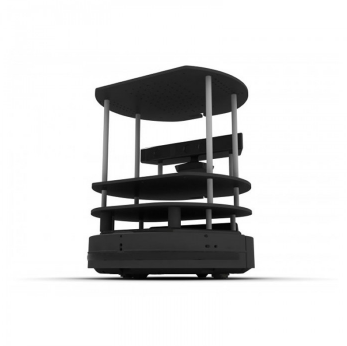
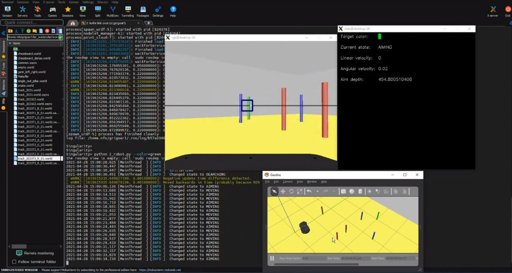

  

# Autonomous Turtle Bot

Semester project to the subject Laboratory of Robotics. Given a "roomba" robot with RGB and depth cameras, the goal is to locate a column of specific color, 
go to its location, avoiding other columns and bump into it. The detailed description can be found in [a PDF file](https://github.com/poludmik/LAR_Robot_Project_.Poludin_Kubov./blob/master/project_description.pdf).
> Work on the project was carried out by two students, kubovyev@fel.cvut.cz and me. So, any usage is forbidden without our both allowances.

Here you can see the process of development using Gazebo simulator:

  

